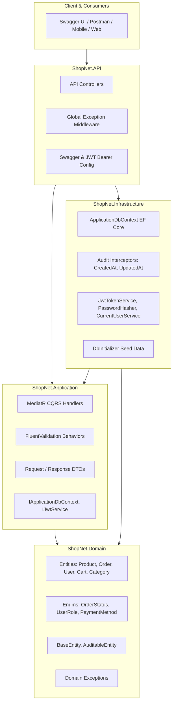

# 🛍️ ShopNet - E-Commerce RESTful Web API (.NET 8 Clean Architecture)

[](https://dotnet.microsoft.com/)
[](https://learn.microsoft.com/en-us/dotnet/csharp/)
[](https://blog.cleancoder.com/uncle-bob/2012/08/13/the-clean-architecture.html)
[](https://github.com/jbogard/MediatR)
[](https://learn.microsoft.com/en-us/ef/core/)
[](https://www.docker.com/)
[](https://github.com/features/actions)
[](LICENSE)

**ShopNet** là một hệ thống Backend Thương mại Điện tử (E-Commerce RESTful API) hiện đại, sẵn sàng cho môi trường Production, được xây dựng bằng **C# 12** và **ASP.NET Core (.NET 8 LTS)** tuân thủ triệt để nguyên lý **Clean Architecture** và mô hình **CQRS (Command Query Responsibility Segregation)**.

---

## 📑 Mục lục
- [Kiến trúc Hệ thống](#-kiến-trúc-hệ-thống)
- [Tính năng Nổi bật](#-tính-năng-nổi-bật)
- [Công nghệ & Thư viện](#-công-nghệ--thư-viện)
- [Cấu trúc Thư mục Solution](#-cấu-trúc-thư-mục-solution)
- [Tài khoản Mặc định (Seed Data)](#-tài-khoản-mặc-định-seed-data)
- [Hướng dẫn Khởi chạy (Quick Start)](#-hướng-dẫn-khởi-chạy-quick-start)
- [Danh sách API Endpoints](#-danh-sách-api-endpoints)
- [Ví dụ Gọi API với cURL](#-ví-dụ-gọi-api-với-curl)
- [Chạy với Docker](#-chạy-với-docker)
- [Quy trình CI/CD](#-quy-trình-cicd)
- [Bản quyền (License)](#-bản-quyền-license)

---

## 🏛️ Kiến trúc Hệ thống

Dự án áp dụng **Clean Architecture** (hay Onion Architecture) phân tách rõ ràng trách nhiệm giữa các tầng, đảm bảo tính độc lập với UI, Database và các Framework bên ngoài:



### Chi tiết các tầng:
1. **`ShopNet.Domain`**: Lớp lõi chứa các thực thể nghiệp vụ (Entities), Enums, và ngoại lệ miền (Domain Exceptions). Hoàn toàn không phụ thuộc vào bất kỳ thư viện bên ngoài nào.
2. **`ShopNet.Application`**: Lớp xử lý logic nghiệp vụ trung tâm. Sử dụng **MediatR** để triển khai CQRS, **FluentValidation** qua Pipeline Behavior để kiểm tra dữ liệu đầu vào tự động.
3. **`ShopNet.Infrastructure`**: Triển khai tương tác tầng dữ liệu với **Entity Framework Core (SQLite / SQL Server)**, băm mật khẩu bảo mật PBKDF2, sinh mã JWT và lấy thông tin User hiện tại từ HttpContext.
4. **`ShopNet.API`**: Cung cấp các RESTful Endpoints, Global Exception Handling Middleware chuẩn RFC 7807, Swagger UI có nút Authorize JWT và cấu hình Dependency Injection.
5. **`ShopNet.UnitTests`**: Bộ kiểm thử tự động sử dụng **xUnit**, **Moq** và **FluentAssertions**.

---

## ✨ Tính năng Nổi bật

- [x] **Xác thực & Phân quyền (Authentication & RBAC)**:
  - Đăng ký, Đăng nhập với cơ chế băm mật khẩu bảo mật PBKDF2 (10.000 rounds + salt ngẫu nhiên).
  - Cấp phát Access Token (JWT HMAC-SHA256) và Refresh Token thời hạn dài.
  - Phân quyền theo vai trò người dùng (`Admin` và `Customer`).
- [x] **Quản lý Danh mục & Sản phẩm (Catalog Management)**:
  - Tra cứu sản phẩm với bộ lọc đa năng: tìm kiếm từ khóa, danh mục, khoảng giá, sắp xếp theo giá/ngày tạo.
  - Phân trang bất đồng bộ hiệu quả cao (`PaginatedList<T>`).
  - Quản trị viên (Admin) thêm, sửa, xóa (Soft Delete) sản phẩm và danh mục.
- [x] **Giỏ hàng (Shopping Cart)**:
  - Thêm, sửa số lượng, xóa từng món hoặc làm trống giỏ hàng theo từng người dùng.
  - Kiểm tra tồn kho theo thời gian thực khi đưa vào giỏ.
- [x] **Quy trình Đặt hàng (Checkout & Order Management)**:
  - Chuyển đổi giỏ hàng thành Đơn hàng với mã vận đơn tự động sinh dạng `ORD-yyyyMMddHHmmss-XXX`.
  - Trừ số lượng kho tự động ngay khi đặt hàng thành công (Atomicity).
  - Người dùng tra cứu lịch sử đơn hàng của bản thân; Admin quản lý và cập nhật trạng thái toàn bộ đơn hàng (`Pending` ➔ `Paid` ➔ `Processing` ➔ `Shipped` ➔ `Delivered` ➔ `Cancelled`).
- [x] **Kiến trúc & Tiêu chuẩn API Chuyên nghiệp**:
  - Chuẩn hóa toàn bộ phản hồi trả về qua cấu trúc `Result<T>` (`isSuccess`, `data`, `message`, `errors`, `statusCode`).
  - Middleware bắt lỗi tập trung (Global Exception Handling Middleware), không để lộ stack trace nhạy cảm.
  - Audit Trail tự động ghi nhận `CreatedAt`, `UpdatedAt`, `CreatedBy`, `UpdatedBy` qua EF Core Interceptor.
- [x] **DevOps & Tự động hóa**:
  - Hỗ trợ chạy trực tiếp với SQLite không cần cài database ngoài.
  - Dockerfile tối ưu đa tầng (Multi-stage build) và `docker-compose.yml`.
  - GitHub Actions CI Pipeline tự động kiểm tra cú pháp, build và chạy unit tests khi push code.

---

## 🛠️ Công nghệ & Thư viện

| Thành phần | Công nghệ / Thư viện | Phiên bản |
| :--- | :--- | :--- |
| **Framework** | ASP.NET Core Web API (.NET 8 LTS) | `8.0` |
| **Ngôn ngữ** | C# | `12.0` |
| **Mô hình CQRS** | MediatR | `12.4.1` |
| **Data Validation** | FluentValidation.DependencyInjectionExtensions | `11.9.2` |
| **ORM & Database** | Entity Framework Core (SQLite Provider) | `8.0.10` |
| **Bảo mật & Auth** | Microsoft.AspNetCore.Authentication.JwtBearer | `8.0.10` |
| **Tài liệu API** | Swashbuckle.AspNetCore (Swagger UI) | `6.6.2` |
| **Testing** | xUnit, Moq, FluentAssertions, EF Core InMemory | `Latest` |
| **Container** | Docker & Docker Compose | - |
| **CI/CD** | GitHub Actions | `v4` |

---

## 📁 Cấu trúc Thư mục Solution

```text
ShopNet/
├── .github/
│   └── workflows/
│       └── ci.yml                     # Pipeline tự động CI với GitHub Actions
├── src/
│   ├── ShopNet.Domain/               # Lõi Domain: Entities, Enums, Exceptions
│   │   ├── Common/                   # BaseEntity, AuditableEntity
│   │   ├── Entities/                 # Product, Category, User, Cart, Order
│   │   ├── Enums/                    # UserRole, OrderStatus, PaymentMethod
│   │   └── Exceptions/               # DomainExceptions (BadRequest, NotFound,...)
│   ├── ShopNet.Application/          # Logic Nghiệp vụ & CQRS
│   │   ├── Common/                   # Models (Result, PaginatedList), Behaviors
│   │   └── Features/                 # Auth, Categories, Products, Cart, Orders
│   ├── ShopNet.Infrastructure/       # Dữ liệu & Dịch vụ bên ngoài
│   │   ├── Persistence/              # ApplicationDbContext, Interceptors, DbInitializer
│   │   └── Services/                 # JwtTokenService, PasswordHasher, CurrentUserService
│   └── ShopNet.API/                  # Presentation Layer
│       ├── Controllers/              # Auth, Products, Categories, Cart, Orders
│       ├── Extensions/               # Swagger Extensions
│       ├── Middlewares/              # Global Exception Handling Middleware
│       └── Program.cs                # Entry Point & Pipeline Setup
├── tests/
│   └── ShopNet.UnitTests/            # Automated Unit Tests
├── Dockerfile                         # Multi-stage Docker image
├── docker-compose.yml                 # Local orchestration
├── ShopNet.sln                       # Visual Studio Solution File
└── README.md                          # Tài liệu dự án
```

---

## 🔑 Tài khoản Mặc định (Seed Data)

Khi khởi động lần đầu, hệ thống tự động khởi tạo cơ sở dữ liệu kèm dữ liệu mẫu:

| Loại tài khoản | Email | Tên đăng nhập | Mật khẩu | Quyền hạn |
| :--- | :--- | :--- | :--- | :--- |
| **Quản trị viên (Admin)** | `admin@shopnet.com` | `admin` | `Admin@123` | Quản lý sản phẩm, danh mục, cập nhật đơn hàng |
| **Khách hàng (Customer)** | `customer@shopnet.com` | `customer` | `Customer@123` | Mua hàng, giỏ hàng, xem đơn hàng của mình |

---

## 🚀 Hướng dẫn Khởi chạy (Quick Start)

### Yêu cầu hệ thống
- [.NET 8.0 SDK](https://dotnet.microsoft.com/download/dotnet/8.0) trở lên
- Git

### 1. Clone repository
```bash
git clone https://github.com/<your-username>/ShopNet.git
cd ShopNet
```

### 2. Khôi phục packages & Build
```bash
dotnet restore
dotnet build
```

### 3. Chạy toàn bộ Unit Tests
```bash
dotnet test
```

### 4. Khởi chạy ứng dụng
```bash
dotnet run --project src/ShopNet.API/ShopNet.API.csproj
```

Ứng dụng sẽ khởi động tại:
- **Swagger UI**: [http://localhost:5000](http://localhost:5000) (hoặc URL hiển thị trên terminal).

---

## 📡 Danh sách API Endpoints

### 🔐 Xác thực (Authentication)
| Method | Endpoint | Quyền hạn | Mô tả |
| :--- | :--- | :--- | :--- |
| `POST` | `/api/auth/register` | Công khai | Đăng ký tài khoản khách hàng mới |
| `POST` | `/api/auth/login` | Công khai | Đăng nhập nhận JWT Access & Refresh Token |
| `POST` | `/api/auth/refresh-token` | Công khai | Cấp mới Access Token khi token cũ hết hạn |
| `GET` | `/api/auth/me` | Đã đăng nhập | Xem thông tin tài khoản hiện tại |

### 🏷️ Danh mục sản phẩm (Categories)
| Method | Endpoint | Quyền hạn | Mô tả |
| :--- | :--- | :--- | :--- |
| `GET` | `/api/categories` | Công khai | Lấy danh sách danh mục và số lượng sản phẩm |
| `POST` | `/api/categories` | **Admin** | Tạo danh mục mới |

### 📦 Sản phẩm (Products)
| Method | Endpoint | Quyền hạn | Mô tả |
| :--- | :--- | :--- | :--- |
| `GET` | `/api/products` | Công khai | Lấy danh sách sản phẩm (tìm kiếm, lọc giá, phân trang) |
| `GET` | `/api/products/{id}` | Công khai | Xem chi tiết 1 sản phẩm |
| `POST` | `/api/products` | **Admin** | Thêm sản phẩm mới |
| `PUT` | `/api/products/{id}` | **Admin** | Cập nhật thông tin sản phẩm |
| `DELETE` | `/api/products/{id}` | **Admin** | Xóa mềm sản phẩm (Soft Delete) |

### 🛒 Giỏ hàng (Cart)
| Method | Endpoint | Quyền hạn | Mô tả |
| :--- | :--- | :--- | :--- |
| `GET` | `/api/cart` | Đã đăng nhập | Xem thông tin giỏ hàng của tài khoản |
| `POST` | `/api/cart/items` | Đã đăng nhập | Thêm sản phẩm vào giỏ hàng |
| `PUT` | `/api/cart/items` | Đã đăng nhập | Cập nhật số lượng sản phẩm trong giỏ |
| `DELETE` | `/api/cart/items/{productId}` | Đã đăng nhập | Xóa sản phẩm khỏi giỏ |

### 💳 Đơn hàng (Orders)
| Method | Endpoint | Quyền hạn | Mô tả |
| :--- | :--- | :--- | :--- |
| `POST` | `/api/orders/checkout` | Đã đăng nhập | Đặt hàng từ giỏ (tự trừ kho & xóa giỏ) |
| `GET` | `/api/orders` | Đã đăng nhập | Xem lịch sử đơn hàng (Admin xem tất cả) |
| `GET` | `/api/orders/{id}` | Đã đăng nhập | Xem chi tiết đơn hàng |
| `PATCH` | `/api/orders/{id}/status` | **Admin** | Cập nhật trạng thái đơn hàng |

---

## 💻 Ví dụ Gọi API với cURL

### 1. Đăng nhập Admin
```bash
curl -X POST "http://localhost:5000/api/auth/login" \
  -H "Content-Type: application/json" \
  -d '{"emailOrUsername": "admin@shopnet.com", "password": "Admin@123"}'
```

### 2. Tra cứu sản phẩm kèm phân trang & lọc
```bash
curl -X GET "http://localhost:5000/api/products?search=MacBook&pageIndex=1&pageSize=5"
```

### 3. Thêm sản phẩm vào giỏ hàng (kèm Token)
```bash
curl -X POST "http://localhost:5000/api/cart/items" \
  -H "Authorization: Bearer <TOKEN_CỦA_BẠN>" \
  -H "Content-Type: application/json" \
  -d '{"productId": 1, "quantity": 1}'
```

### 4. Đặt hàng (Checkout)
```bash
curl -X POST "http://localhost:5000/api/orders/checkout" \
  -H "Authorization: Bearer <TOKEN_CỦA_BẠN>" \
  -H "Content-Type: application/json" \
  -d '{
    "shippingAddress": "72 Le Thanh Ton, Quan 1, TP. Ho Chi Minh",
    "phoneNumber": "0987654321",
    "notes": "Giao hang trong gio hanh chinh",
    "paymentMethod": 1
  }'
```

---

## 🐳 Chạy với Docker

Dự án cung cấp sẵn cấu hình Docker Compose để khởi chạy tức thì trên mọi môi trường:

```bash
# Build và khởi chạy container
docker compose up -d --build

# Xem log tiến trình
docker compose logs -f

# Dừng hệ thống
docker compose down
```

Sau khi chạy, truy cập Swagger UI tại: [http://localhost:5000](http://localhost:5000).

---

## 🔄 Quy trình CI/CD

Repository được tích hợp sẵn GitHub Actions (`.github/workflows/ci.yml`) để tự động hóa quy trình kiểm thử và tích hợp liên tục:
1. Tự động kích hoạt khi có `git push` hoặc tạo `Pull Request` vào nhánh `main`.
2. Khởi tạo môi trường .NET 8 SDK trên runner Ubuntu mới nhất.
3. Chạy `dotnet restore` và `dotnet build` ở chế độ `Release`.
4. Thực thi toàn bộ bộ Unit Tests bằng `dotnet test`, đảm bảo không có bất kỳ regression bug nào được đưa vào nhánh chính.

---

## 📄 Bản quyền (License)

Dự án được phân phối dưới giấy phép [MIT License](LICENSE). Bạn hoàn toàn tự do sử dụng, chỉnh sửa và đưa vào hồ sơ Portfolio cá nhân!
